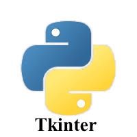

# GUI PROGRAMMING WITH Tkinter IN Python3
****
## Hi floks,
### About Tkinder : Tkinder is a Standard GUI library for Python , Python When combined with Tkinder can Provide a fast and Easy Way to create GUI applications
### It can said as a powerfull object-oriented interface to tk toolkit 
### Installing : Can be installed in Ubuntu with command `sudo apt-get install python3-tkinter`  [Windows Installation](https://www.activestate.com/resources/quick-reads/how-to-install-tkinter-in-windows/)
****
**Some of the Widgets in tkinter**
-Label : For Displaying Text or Images
-Message   : For Displaying messages 
-Entry : Provide single line input field where user can type or edit text
-Text : Provide multiline Text-input and display
-Button : To create Clickable button that trigger actions when clicked 
-TkMessagebox : To create options and selections
-Radiobutton
-Checkbutton
-Listbox
-Menu
-Menubutton
-scale
-scrollbar
-canvas
***

**Layout managers in Tkinter**
1.Pack
2.Grid
3.Place

###layout managers are used for Aranging Widgets on screen###
###They can be used to manage display of widgets on screen###